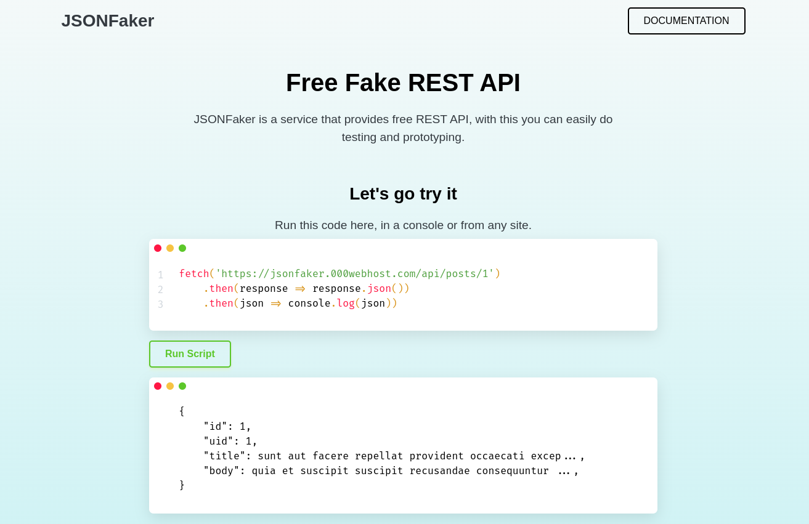

<p align="center">
    
</p>

## Introduction
JSONFaker is a free fake REST API for testing and prototyping.

## URL
- [jsonfaker](https://jsonfaker.000webhostapp.com/)
- [jsonfaker documentation](https://jsonfaker.000webhostapp.com/apidocs/)

### Requirement
- PHP ^8.0
- Lumen ^8.0

### Knowledge base 
- [jsonplaceholder](https://jsonplaceholder.typicode.com/)

### Usage 
- git clone
- composer install
- copy ``.env.example`` to ``.env``
- set ``APP_KEY`` execute command :
```bash
php artisan key:generate
```
- set ``JWT_SECRET`` execute command :
```bash
php artisan jwt:secret
```
- set ownership of the file run.sh and apidocs.sh
```bash
sudo chmod 777 ./run.sh ./apidocs.sh
```

### Running service
```bash      
./run.sh
```

### Generate docs swagger-php
```bash
./apidocs.sh
```

> We invite you to contribute to the development of this project and become part of our amazing community.

## How to Contribute

You can contribute to this project by doing the following:

- Submitting pull requests to fix bugs or enhance functionality.
- Providing suggestions, feedback, or bug reports through project issues.
- Helping to resolve existing issues or working on outstanding tasks.

## Contribution Guidelines

We appreciate every contribution you make. To get started with contributing, please follow these guidelines:

1. **Fork** this repository and clone it to your local machine.
2. Create a new **branch** for each feature, fix, or change you want to make.
3. Make the necessary changes to the source code.
4. Commit and **push** your changes to your new branch.
5. Submit a **pull request** from your branch to the main branch of this repository.

Please make sure to clearly explain the changes you made and why they are needed. We will carefully review each pull request and provide feedback as soon as possible.
